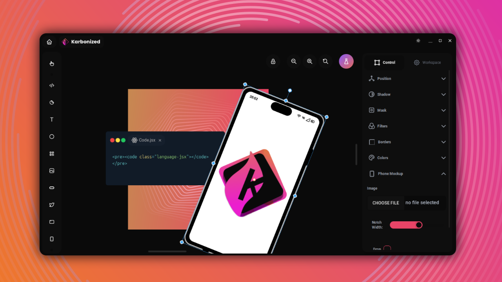

<h1 align="center">Karbonized</h1>

⭐ Make amazing images of your screenshots or your code and share them with the world 🌎

<b>Free</b> and <b>Open Source</b>  Carbon App. Made with ❤️ and ReactJS in 🇨🇺.

[Check it out](https://karbonized.onrender.com)

## 🚀 Features

* 🤖 Based on **blocks** (Code,Text,QR, Mobile Mockup, Icons and more)
* 🆓 Completely **Free** and **Open Source**
* 😍 Without Registration
* 🤩 Without Limits
* 😎 Made with ReactJS 😎

## 👥 Contribution

Karbonized is currently under development so your help is always welcome 😄
