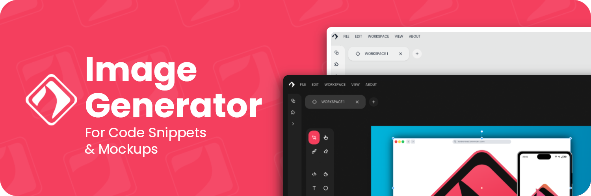

<h1 align="center">Karbonized</h1>

Styling your code with Karbonized and share it with the world

<b>Free</b> and <b>Open Source</b>  carbon App. Made with ❤️ and ReactJS in 🇨🇺.

[Check it out](https://karbonized.onrender.com)

## 🚀 Features

* Based on **blocks** (Code,Text,QR, Mobile Mockup, Icons and more)
* Completely **Free** and **Open Source**
* Without Registration
* Without Limits
* Made with ReactJS 😎

## 🌐 Preview

## 👥 Contribution

Karbonized is currently under development so your help is always welcome 😄
